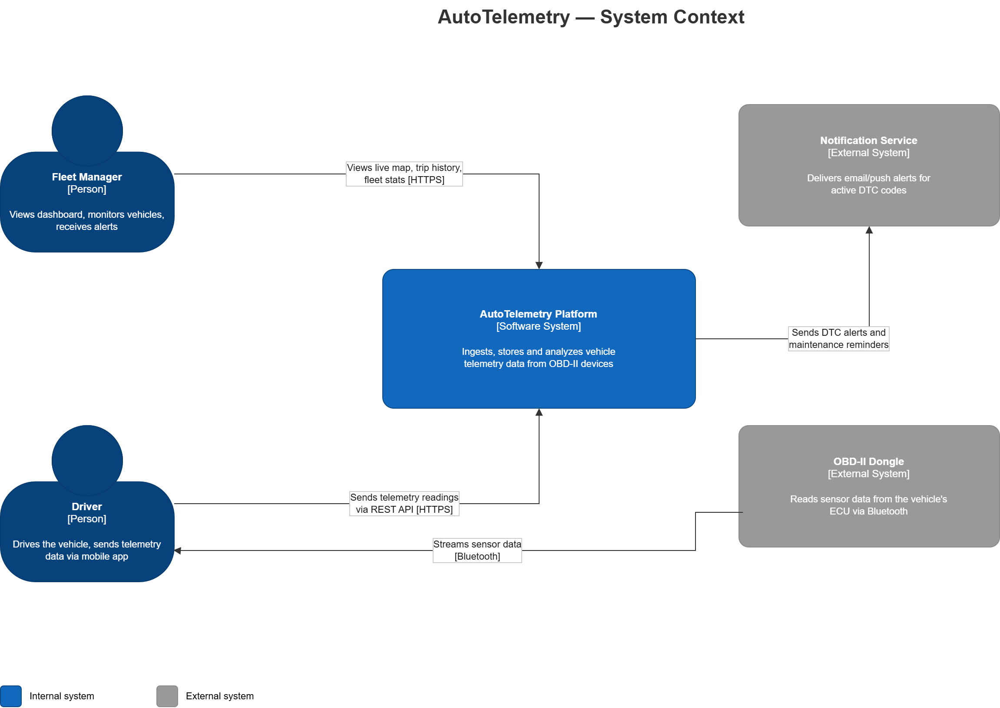
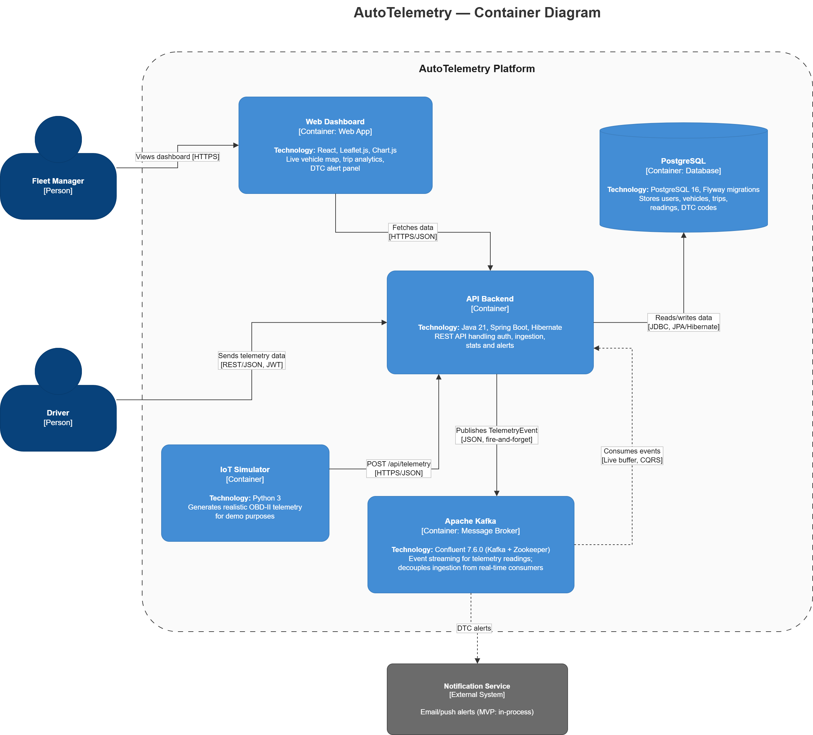
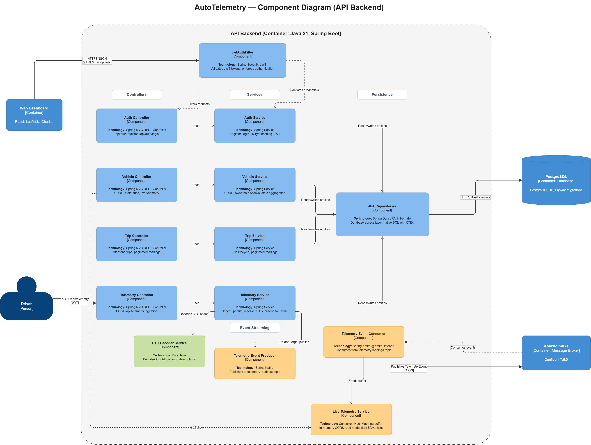
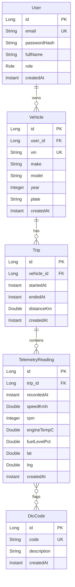

# Architecture — AutoTelemetry

> **Software Architecture Document (SAD)** for the AutoTelemetry platform.
> Uses the [C4 model](https://c4model.com/) for visual architecture and
> [Architecture Decision Records (ADRs)](#architecture-decision-records) for
> key technology choices.

---

## Table of Contents

- [1. System Overview](#1-system-overview)
- [2. C4 Architecture Diagrams](#2-c4-architecture-diagrams)
  - [2.1 Level 1 — System Context](#21-level-1--system-context)
  - [2.2 Level 2 — Container Diagram](#22-level-2--container-diagram)
  - [2.3 Level 3 — Component Diagram (API Backend)](#23-level-3--component-diagram-api-backend)
- [3. Data Model & Dictionary](#3-data-model--dictionary)
  - [3.1 Entity-Relationship Diagram](#31-entity-relationship-diagram)
  - [3.2 Data Dictionary](#32-data-dictionary)
  - [3.3 Why PostgreSQL (RDBMS) over NoSQL?](#33-why-postgresql-rdbms-over-nosql)
- [4. API Contract](#4-api-contract)
  - [4.1 Authentication](#41-authentication)
  - [4.2 Vehicle Endpoints](#42-vehicle-endpoints)
  - [4.3 Trip Endpoints](#43-trip-endpoints)
  - [4.4 Telemetry Ingestion](#44-telemetry-ingestion)
  - [4.5 Live Telemetry (Kafka CQRS)](#45-live-telemetry-kafka-cqrs)
  - [4.6 Statistics](#46-statistics)
  - [4.7 Error Responses](#47-error-responses)
- [5. Architecture Decision Records](#5-architecture-decision-records)
  - [ADR-1: Stateless JWT Authentication](#adr-1-stateless-jwt-authentication)
  - [ADR-2: Flyway for Schema Migrations](#adr-2-flyway-for-schema-migrations)
  - [ADR-3: Kafka Event Streaming for Telemetry](#adr-3-kafka-event-streaming-for-telemetry)
  - [ADR-4: CQRS Live Buffer](#adr-4-cqrs-live-buffer)
- [6. Scalability & Data Lifecycle](#6-scalability--data-lifecycle)
  - [6.1 Storage Sizing](#61-storage-sizing)
  - [6.2 Data Retention Policy](#62-data-retention-policy)
  - [6.3 Performance Strategy](#63-performance-strategy)

---

## 1. System Overview

AutoTelemetry is a **backend platform** that ingests, stores, and analyzes
vehicle telemetry data transmitted from OBD-II (On-Board Diagnostics) devices.

**Core capabilities:**
- Ingest high-frequency sensor data (speed, RPM, engine temperature, fuel level, GPS coordinates)
- Capture and decode OBD-II Diagnostic Trouble Codes (DTCs) — the same codes a mechanic reads when your "check engine" light is on
- Stream ingested readings through Apache Kafka for real-time processing and CQRS live queries
- Reconstruct trips from raw readings (start → readings → end)
- Provide aggregated fleet statistics (average speed, max RPM, fuel consumption, active faults)
- Authenticate users and enforce per-user resource ownership

**Target users:**
- **Fleet Manager** — monitors vehicles via a dashboard, receives DTC alerts
- **Driver** — drives the vehicle; a mobile app transmits telemetry data to the platform

---

## 2. C4 Architecture Diagrams

> Diagrams follow the [C4 model](https://c4model.com/) by Simon Brown.
> Blue = internal systems/components. Grey = external systems.
> Editable `.drawio` source files are in [`docs/diagrams/`](docs/diagrams/).

### 2.1 Level 1 — System Context

Shows what the system does and who interacts with it.



| Element | Type | Description |
|---------|------|-------------|
| **Fleet Manager** | Person | Views dashboard, monitors vehicles, receives alerts |
| **Driver** | Person | Drives the vehicle, sends telemetry data via mobile app |
| **AutoTelemetry Platform** | Software System | Ingests, stores and analyzes vehicle telemetry data from OBD-II devices |
| **OBD-II Dongle** | External System | Reads sensor data from the vehicle's ECU via Bluetooth |
| **Notification Service** | External System | Delivers email/push alerts for active DTC codes |

### 2.2 Level 2 — Container Diagram

Zooms into the AutoTelemetry Platform to show its internal containers.



| Container | Technology | Description |
|-----------|-----------|-------------|
| **Web Dashboard** | React, Leaflet.js, Chart.js | Live vehicle map, trip analytics, DTC alert panel |
| **API Backend** | Java 21, Spring Boot, Hibernate | REST API handling auth, ingestion, stats and alerts |
| **Apache Kafka** | Confluent 7.6.0 (Kafka + Zookeeper) | Event streaming for telemetry readings; decouples ingestion from real-time consumers |
| **IoT Simulator** | Python 3 | Generates realistic OBD-II telemetry for demo purposes |
| **PostgreSQL** | PostgreSQL 16, Flyway | Stores users, vehicles, trips, readings, DTC codes |

### 2.3 Level 3 — Component Diagram (API Backend)

Zooms into the API Backend container to show its internal components.



The API Backend follows a **Layered Architecture** with clearly separated layers:

```
HTTP Request → Security Filter → Controller → Service → Repository → Database
                                                  ↓
                                          Kafka Producer → Topic → Consumer → Live Buffer
```

| Layer | Components | Responsibility |
|-------|-----------|----------------|
| **Security** | JwtAuthFilter (Spring Security, JWT) | Validates JWT tokens, rejects unauthenticated requests before they reach business logic |
| **Controllers** | Auth, Vehicle, Trip, Telemetry | HTTP endpoint handlers — parse requests, delegate to services, return responses |
| **Services** | Auth, Vehicle, Trip, Telemetry, DtcDecoder, LiveTelemetry | Business logic — validation, ownership checks, DTC decoding, Kafka publishing |
| **Event Streaming** | TelemetryEventProducer, TelemetryEventConsumer | Publishes readings to Kafka; consumer feeds in-memory CQRS live buffer |
| **Persistence** | JPA Repositories | Data access layer — Spring Data JPA interfaces with derived and native queries |

---

## 3. Data Model & Dictionary

### 3.1 Entity-Relationship Diagram

```
User 1──* Vehicle 1──* Trip 1──* TelemetryReading *──* DtcCode
```



### 3.2 Data Dictionary

#### `users`

| Column | Type | Constraints | Description |
|--------|------|------------|-------------|
| `id` | `BIGSERIAL` | `PRIMARY KEY` | Auto-generated surrogate key |
| `email` | `VARCHAR(255)` | `NOT NULL, UNIQUE` | Login identifier |
| `password_hash` | `VARCHAR(255)` | `NOT NULL` | BCrypt-hashed password (never stored in plain text) |
| `full_name` | `VARCHAR(255)` | `NOT NULL` | Display name |
| `role` | `VARCHAR(20)` | `NOT NULL, DEFAULT 'USER'` | Authorization role: `USER` or `ADMIN` |
| `created_at` | `TIMESTAMPTZ` | `NOT NULL, DEFAULT now()` | Row creation timestamp (UTC) |

#### `vehicles`

| Column | Type | Constraints | Description |
|--------|------|------------|-------------|
| `id` | `BIGSERIAL` | `PRIMARY KEY` | Auto-generated surrogate key |
| `user_id` | `BIGINT` | `NOT NULL, FK → users(id) ON DELETE CASCADE` | Owning user |
| `vin` | `VARCHAR(17)` | `NOT NULL, UNIQUE` | Vehicle Identification Number (ISO 3779) |
| `make` | `VARCHAR(100)` | `NOT NULL` | Manufacturer (e.g., "BMW") |
| `model` | `VARCHAR(100)` | `NOT NULL` | Model name (e.g., "320d") |
| `year` | `INT` | nullable | Model year |
| `plate` | `VARCHAR(20)` | nullable | License plate number |
| `created_at` | `TIMESTAMPTZ` | `NOT NULL, DEFAULT now()` | Row creation timestamp |

**Indexes:** `idx_vehicles_user(user_id)` — accelerates "list all vehicles for a user" queries.

#### `trips`

| Column | Type | Constraints | Description |
|--------|------|------------|-------------|
| `id` | `BIGSERIAL` | `PRIMARY KEY` | Auto-generated surrogate key |
| `vehicle_id` | `BIGINT` | `NOT NULL, FK → vehicles(id) ON DELETE CASCADE` | Vehicle this trip belongs to |
| `started_at` | `TIMESTAMPTZ` | `NOT NULL` | Trip start timestamp |
| `ended_at` | `TIMESTAMPTZ` | nullable | Trip end timestamp (null while trip is active) |
| `distance_km` | `DOUBLE PRECISION` | nullable | Total distance driven (calculated on trip end) |
| `created_at` | `TIMESTAMPTZ` | `NOT NULL, DEFAULT now()` | Row creation timestamp |

**Indexes:** `idx_trips_vehicle(vehicle_id)` — accelerates "list all trips for a vehicle" queries.

#### `telemetry_readings`

| Column | Type | Constraints | Description |
|--------|------|------------|-------------|
| `id` | `BIGSERIAL` | `PRIMARY KEY` | Auto-generated surrogate key |
| `trip_id` | `BIGINT` | `NOT NULL, FK → trips(id) ON DELETE CASCADE` | Trip this reading belongs to |
| `recorded_at` | `TIMESTAMPTZ` | `NOT NULL` | When the sensor generated this sample (device clock) |
| `speed_kmh` | `DOUBLE PRECISION` | nullable | Vehicle speed in km/h |
| `rpm` | `INT` | nullable | Engine RPM |
| `engine_temp_c` | `DOUBLE PRECISION` | nullable | Engine coolant temperature (°C) |
| `fuel_level_pct` | `DOUBLE PRECISION` | nullable | Fuel level as percentage (0.0–100.0) |
| `lat` | `DOUBLE PRECISION` | nullable | GPS latitude |
| `lng` | `DOUBLE PRECISION` | nullable | GPS longitude |
| `created_at` | `TIMESTAMPTZ` | `NOT NULL, DEFAULT now()` | When the reading was ingested into the DB |

**Indexes:**
- `idx_readings_trip(trip_id)` — accelerates trip reconstruction queries.
- `idx_readings_recorded_at(recorded_at)` — accelerates time-range queries for stats and live data. Added in `V2__add_readings_recorded_at_index.sql`.

`recorded_at` ≠ `created_at`. The sensor may batch readings and send them later (e.g., driving through a tunnel with no signal). `recorded_at` is when the sample was taken; `created_at` is when it arrived in our database.

#### `dtc_codes`

| Column | Type | Constraints | Description |
|--------|------|------------|-------------|
| `id` | `BIGSERIAL` | `PRIMARY KEY` | Auto-generated surrogate key |
| `code` | `VARCHAR(10)` | `NOT NULL, UNIQUE` | OBD-II standard code (e.g., `P0301` = Cylinder 1 Misfire) |
| `description` | `VARCHAR(500)` | `NOT NULL` | Human-readable explanation |
| `created_at` | `TIMESTAMPTZ` | `NOT NULL, DEFAULT now()` | Row creation timestamp |

> This is a **reference table** — populated with known OBD-II codes. It is read-only in normal operation.

#### `reading_dtc_codes` (join table)

| Column | Type | Constraints | Description |
|--------|------|------------|-------------|
| `reading_id` | `BIGINT` | `NOT NULL, FK → telemetry_readings(id) ON DELETE CASCADE` | The reading |
| `dtc_code_id` | `BIGINT` | `NOT NULL, FK → dtc_codes(id) ON DELETE CASCADE` | The active fault code |

**Primary Key:** `(reading_id, dtc_code_id)` — a code can only appear once per reading.

### 3.3 Why PostgreSQL (RDBMS) over NoSQL?

| Consideration | PostgreSQL (chosen) | MongoDB / NoSQL |
|---------------|-------------------|-----------------|
| **Referential integrity** | FK constraints enforce `User → Vehicle → Trip → Reading` hierarchy at the database level | Must be enforced in application code — error-prone |
| **ACID transactions** | Native — one trip start + N readings + DTC attachments = single atomic operation | Eventual consistency; multi-document transactions are limited |
| **Aggregation queries** | SQL `AVG()`, `MAX()`, `GROUP BY` over time ranges — battle-tested, optimizable with indexes | Aggregation pipeline works but is more complex for relational-style queries |
| **Schema evolution** | Flyway versioned migrations — predictable, auditable | Schemaless sounds flexible but makes backward compatibility harder to reason about |
| **Ecosystem fit** | Spring Data JPA + Hibernate = mature, well-documented integration | Spring Data MongoDB exists but JPA is the industry standard for enterprise Java |

---

## 4. API Contract

> Base URL: `http://localhost:8080`
> All endpoints except `/api/auth/*` and `/api/health` require a valid JWT in the `Authorization: Bearer <token>` header.

### 4.1 Authentication

#### `POST /api/auth/register`

Creates a new user account.

**Request:**
```json
{
  "email": "gabriel@example.com",
  "password": "SecureP@ss123",
  "fullName": "Gabriel Bicu"
}
```

**Response** `200 OK`:
```json
{
  "token": "eyJhbGciOiJIUzI1NiJ9...",
  "userId": 1,
  "email": "gabriel@example.com",
  "fullName": "Gabriel Bicu"
}
```

**Errors:** `409 Conflict` — email already exists.

#### `POST /api/auth/login`

Authenticates a user and returns a JWT.

**Request:**
```json
{
  "email": "gabriel@example.com",
  "password": "SecureP@ss123"
}
```

**Response** `200 OK`:
```json
{
  "token": "eyJhbGciOiJIUzI1NiJ9...",
  "userId": 1,
  "email": "gabriel@example.com",
  "fullName": "Gabriel Bicu"
}
```

**Errors:** `401 Unauthorized` — invalid credentials.

### 4.2 Vehicle Endpoints

#### `POST /api/vehicles`

**Request:**
```json
{
  "vin": "WBA3A5G59DNP26082",
  "make": "BMW",
  "model": "320d",
  "year": 2019,
  "plate": "SB-01-ABC"
}
```

**Response** `201 Created`:
```json
{
  "id": 1,
  "vin": "WBA3A5G59DNP26082",
  "make": "BMW",
  "model": "320d",
  "year": 2019,
  "plate": "SB-01-ABC",
  "createdAt": "2026-07-06T14:35:00Z"
}
```

**Errors:** `409 Conflict` — VIN already exists.

#### `GET /api/vehicles`

Returns all vehicles belonging to the authenticated user.

**Response** `200 OK`:
```json
[
  {
    "id": 1,
    "vin": "WBA3A5G59DNP26082",
    "make": "BMW",
    "model": "320d",
    "year": 2019,
    "plate": "SB-01-ABC",
    "createdAt": "2026-07-06T14:35:00Z"
  }
]
```

#### `GET /api/vehicles/{id}`

Returns a single vehicle. **Ownership check:** returns `404` if the vehicle does not belong to the authenticated user.

#### `DELETE /api/vehicles/{id}`

Deletes a vehicle and all its trips/readings (cascading). Returns `204 No Content`.

### 4.3 Trip Endpoints

#### `POST /api/trips`

Starts a new trip for a vehicle.

**Request:**
```json
{
  "vehicleId": 1
}
```

**Response** `201 Created`:
```json
{
  "id": 1,
  "vehicleId": 1,
  "startedAt": "2026-07-06T15:00:00Z",
  "endedAt": null,
  "distanceKm": null,
  "createdAt": "2026-07-06T15:00:00Z"
}
```

#### `POST /api/trips/{id}/end`

Ends an active trip. The system calculates `distanceKm` from the GPS readings.

**Response** `200 OK`:
```json
{
  "id": 1,
  "vehicleId": 1,
  "startedAt": "2026-07-06T15:00:00Z",
  "endedAt": "2026-07-06T16:30:00Z",
  "distanceKm": 85.3,
  "createdAt": "2026-07-06T15:00:00Z"
}
```

#### `GET /api/vehicles/{id}/trips`

Returns all trips for a vehicle.

#### `GET /api/trips/{id}/readings?page=0&size=20`

Returns paginated readings for a trip.

**Response** `200 OK`: Spring `Page<TelemetryReadingResponse>` with `content`, `totalElements`, `totalPages`, `number`.

### 4.4 Telemetry Ingestion

#### `POST /api/telemetry`

The **central ingestion endpoint**. Persists the reading to PostgreSQL, resolves DTC codes via `DtcDecoderService` (auto-creates unknown codes with decoded descriptions), then publishes a `TelemetryEvent` to the `telemetry.readings` Kafka topic (fire-and-forget — Kafka failure does not fail the HTTP response).

**Request:**
```json
{
  "tripId": 1,
  "recordedAt": "2026-07-06T15:00:01Z",
  "speedKmh": 45.2,
  "rpm": 2100,
  "engineTempC": 85.0,
  "fuelLevelPct": 72.5,
  "lat": 45.7925,
  "lng": 24.1524,
  "dtcCodes": ["P0301"]
}
```

**Response** `201 Created`: `TelemetryReadingResponse` with the persisted reading ID.

**Validation rules:** `tripId` required, `recordedAt` required, `speedKmh` ≥ 0, `rpm` ≥ 0, `engineTempC` ≥ -40, `fuelLevelPct` 0–100.

**Errors:**
- `400 Bad Request` — invalid payload, missing required fields
- `404 Not Found` — trip does not exist or does not belong to the user

### 4.5 Live Telemetry (Kafka CQRS)

#### `GET /api/vehicles/{id}/live`

Returns the last 50 telemetry events from the in-memory Kafka-fed ring buffer (CQRS read model). This data is ephemeral — it clears on application restart.

**Response** `200 OK`:
```json
[
  {
    "readingId": 42,
    "tripId": 1,
    "vehicleId": 1,
    "recordedAt": "2026-07-06T15:00:01Z",
    "speedKmh": 45.2,
    "rpm": 2100,
    "engineTempC": 85.0,
    "fuelLevelPct": 72.5,
    "dtcCodes": ["P0301"]
  }
]
```

### 4.6 Statistics

#### `GET /api/vehicles/{id}/stats`

Returns aggregated statistics across all trips for a vehicle. Uses a native SQL query with CTEs and the `LEAD()` window function to compute sequential fuel drops (excluding refueling events).

**Response** `200 OK`:
```json
{
  "avgSpeedKmh": 52.3,
  "maxRpm": 5800,
  "totalFuelDropPct": 14.5,
  "activeDtcCount": 2
}
```

### 4.7 Error Responses

All errors follow a consistent `ApiError` format via `@RestControllerAdvice`:

```json
{
  "status": 404,
  "message": "Entity with id 99 was not found",
  "timestamp": "2026-07-06T15:00:00Z",
  "errors": []
}
```

Validation errors include per-field details in the `errors` array.

| Status Code | When |
|-------------|------|
| `400 Bad Request` | Validation failure (`@Valid`, `@NotNull`, malformed JSON) — per-field error messages |
| `401 Unauthorized` | Missing or invalid JWT, invalid login credentials |
| `403 Forbidden` | Valid JWT but insufficient permissions |
| `404 Not Found` | Resource doesn't exist or doesn't belong to the authenticated user (ownership check) |
| `409 Conflict` | Duplicate unique constraint (email, VIN) or business rule violation (e.g., ending an already-ended trip) |
| `500 Internal Server Error` | Unexpected server error (no stack trace leaked) |

---

## 5. Architecture Decision Records

### ADR-1: Stateless JWT Authentication

| | |
|---|---|
| **Status** | Accepted |
| **Context** | The platform needs to authenticate users and protect endpoints. Two main approaches exist: session-based (stateful, server stores session in memory or Redis) and token-based (stateless, client sends JWT with every request). |
| **Decision** | Use **stateless JWT** (JSON Web Tokens) issued on login, validated on every request via a Spring Security filter. |
| **Rationale** | **Scalability** — stateless means we can run multiple API Backend instances behind a load balancer without session synchronization. Each instance independently validates the JWT signature. **Simplicity** — no need for a Redis/session store for an MVP. **Mobile-friendly** — JWTs are trivially stored on mobile devices and sent via `Authorization: Bearer` header. |
| **Consequences** | Token revocation requires a deny-list (not implemented in MVP — tokens simply expire). Token refresh is handled by issuing a new token on re-login. |
| **Alternatives considered** | Spring Session + Redis — adds infrastructure complexity without benefit at current scale. OAuth2/OpenID Connect — overkill for a single-application backend; no third-party identity providers needed. |

### ADR-2: Flyway for Schema Migrations

| | |
|---|---|
| **Status** | Accepted |
| **Context** | Hibernate can auto-generate DDL from entity annotations (`ddl-auto: update`), but this approach is unpredictable in production — it may silently alter columns, drop constraints, or create suboptimal indexes. |
| **Decision** | Use **Flyway** for all DDL changes. Hibernate runs in `validate` mode, checking that entities match the schema but never modifying it. |
| **Rationale** | **Predictability** — every schema change is a versioned SQL file (`V1__init.sql`, `V2__add_index.sql`), reviewed in a PR, and applied in order. **Auditability** — the `flyway_schema_history` table records exactly which migrations ran and when. **Production safety** — the same migration that runs in development runs identically in staging and production. No surprises. |
| **Consequences** | Every schema change requires writing raw SQL. This is an acceptable trade-off — DDL changes are infrequent and SQL is the most precise language for expressing them. |
| **Alternatives considered** | Liquibase — equally valid, but Flyway is more widely used in the Spring Boot ecosystem and has a simpler API for SQL-based migrations. |

### ADR-3: Kafka Event Streaming for Telemetry

| | |
|---|---|
| **Status** | Implemented |
| **Context** | The ingestion path (`POST /api/telemetry`) persists readings synchronously to PostgreSQL. For real-time dashboards and future consumers (alerting, analytics), downstream systems need to react to new readings without polling the database. |
| **Decision** | After persisting a reading to PostgreSQL, the `TelemetryService` publishes a `TelemetryEvent` to the `telemetry.readings` Kafka topic (3 partitions, replication factor 1). A `TelemetryEventConsumer` subscribes to this topic and feeds an in-memory `LiveTelemetryService` ring buffer (CQRS read model). |
| **Rationale** | **Decoupling** — the write path (PostgreSQL) and real-time read path (Kafka → in-memory buffer) are independent. Adding new consumers (e.g., alerting on DTC codes, analytics pipeline) requires zero changes to the ingestion code. **Graceful degradation** — Kafka publishing is fire-and-forget with async callbacks. If Kafka is down, the reading is still persisted to PostgreSQL and the HTTP response succeeds. The live buffer simply misses that event. **Ordering** — reading ID is used as the Kafka message key, ensuring per-reading ordering within a partition. |
| **Consequences** | The live buffer (`ConcurrentHashMap<vehicleId, ArrayDeque<50>>`) is ephemeral — it clears on application restart. This is acceptable for a real-time "last 50 readings" view. Historical data is always available from PostgreSQL. |
| **Infrastructure** | Docker Compose includes Zookeeper + Kafka (Confluent 7.6.0). Producer uses `JsonSerializer`, consumer uses `JsonDeserializer` with trusted packages. |
| **Alternatives considered** | WebSocket push to frontend — adds complexity and state management on the server. Server-Sent Events (SSE) — simpler than WebSocket but still couples the backend to connected clients. Kafka provides a durable, replayable event log that supports multiple independent consumers.

### ADR-4: CQRS Live Buffer

| | |
|---|---|
| **Status** | Implemented |
| **Context** | The `GET /api/vehicles/{id}/live` endpoint needs to return the most recent telemetry data with minimal latency, without querying PostgreSQL on every request. |
| **Decision** | Implement a lightweight CQRS pattern: the Kafka consumer feeds a `LiveTelemetryService` backed by a `ConcurrentHashMap<Long, ArrayDeque<TelemetryEvent>>` (one ring buffer of 50 events per vehicle). The `GET /live` endpoint reads directly from this in-memory structure. |
| **Rationale** | **Read performance** — O(1) lookup by vehicle ID, zero database queries. **Write isolation** — the buffer is updated asynchronously by the Kafka consumer, completely decoupled from the HTTP request path. **Simplicity** — no Redis or external cache needed for this scale. |
| **Consequences** | Data is ephemeral (lost on restart). The buffer is eventually consistent with PostgreSQL (bounded by Kafka consumer lag, typically <100ms). |
| **Alternatives considered** | Redis cache — adds infrastructure. Direct DB query with `LIMIT 50 ORDER BY recorded_at DESC` — works but adds load to PostgreSQL on every live-view request. |

---

## 6. Scalability & Data Lifecycle

### 6.1 Storage Sizing

**Assumptions (worst case — active driving):**

| Parameter | Value |
|-----------|-------|
| Sampling rate | 1 Hz (one reading per second) |
| Readings per row | ~200 bytes (8 doubles + 1 int + 1 timestamp + 1 FK + 1 PK) |
| Average driving time | 2 hours/day per vehicle |
| Fleet size (target) | 100 vehicles |

**Calculation:**

```
1 vehicle, 1 hour active driving:
  3,600 seconds × 200 bytes = 720 KB

1 vehicle, 1 day (2h active):
  2 × 720 KB = 1.44 MB

100 vehicles, 1 day:
  100 × 1.44 MB = 144 MB

100 vehicles, 1 year:
  144 MB × 365 = ~52 GB
```

> **Important caveat:** This is a **peak estimate for active driving only**. In practice, vehicles spend most of their time parked with the engine off — no data is transmitted during inactivity. Real-world daily volume will be significantly lower than 144 MB/day for a 100-vehicle fleet. The estimate represents the upper bound for capacity planning purposes.

### 6.2 Data Retention Policy

Retaining high-frequency raw data indefinitely is neither practical nor necessary. The retention strategy follows a **tiered approach**:

| Tier | Age | What is stored | Storage |
|------|-----|----------------|---------|
| **Hot** | 0–3 months | Raw readings at full 1 Hz resolution | Primary PostgreSQL database |
| **Warm** | 3–12 months | Aggregated summaries (per-minute averages, trip summaries, DTC events) | Same database, separate `trip_summaries` table |
| **Cold** | 12+ months | Trip-level aggregates only (total distance, duration, fuel consumed, DTC history) | Archival or deleted |

**Implementation approach:**
- A scheduled job (`@Scheduled` or PostgreSQL `pg_cron`) runs monthly.
- It aggregates readings older than 90 days into `trip_summaries` (one row per trip: avg speed, max rpm, total distance, fuel consumed).
- The original high-frequency rows are then deleted to reclaim disk space.

### 6.3 Performance Strategy

| Problem | Solution | Status |
|---------|----------|--------|
| Slow range queries on `telemetry_readings` | Index on `recorded_at` (`V2__add_readings_recorded_at_index.sql`) | ✅ Implemented |
| Large result sets (3,600+ readings per trip) | Paginated with `Page<TelemetryReading>` + `Pageable` (default page size 20) | ✅ Implemented |
| High insert throughput | JPA `save()` + Hibernate JDBC batching | ✅ Implemented |
| N+1 query problem | `FetchType.LAZY` on all `@ManyToOne` associations | ✅ Implemented |
| Connection pool exhaustion | HikariCP defaults (10 connections) + batch inserts reduce round-trips | ✅ By design |
| Real-time reads without DB load | Kafka event stream → in-memory CQRS buffer (ADR-3, ADR-4) | ✅ Implemented |
| Complex aggregation queries | Native SQL with CTEs + `LEAD()` window function for fuel drop calculation | ✅ Implemented |

---

## 7. Cloud Deployment Architecture

To demonstrate production deployment without cloud costs or maintenance overhead, the AutoTelemetry containers are mapped to a serverless cloud infrastructure:

| Container | Cloud Provider | Architecture | Cost |
|-----------|----------------|--------------|------|
| **Web Dashboard** | **Vercel** | Global Edge CDN for static SPA React build | Free |
| **API Backend** | **Render** | Dockerized Java 21 Spring Boot Web Service | Free |
| **Database** | **Neon.tech** | Serverless PostgreSQL 16 (Permanent instance, scale-to-zero) | Free |
| **Kafka Stream** | **Aiven** | Managed Apache Kafka Broker | Free |

### Active-on-Demand Simulation Pattern

To keep the live map interactive 24/7 without consuming continuous database compute hours:
1. **Request Interception:** When a visitor opens the live map on Vercel, the browser polls `GET /api/vehicles/{id}/live`.
2. **Activity Recording:** The Spring Boot backend records the request timestamp in a thread-safe `ConcurrentHashMap`.
3. **Reactive Simulation:** An internal background task (`@Profile("demo-active")`) generates 1 Hz physics telemetry only if a poll occurred within the last 10 seconds.
4. **Scale-to-Zero Preservation:** If no visitor is viewing the map, database writes pause after 10 seconds, allowing the Neon PostgreSQL serverless database to scale to zero after 5 minutes of inactivity.
