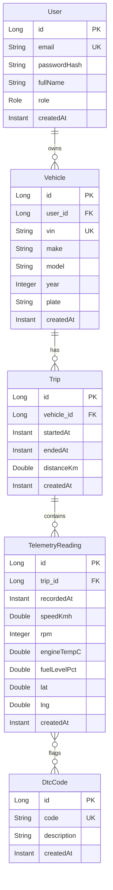

# AutoTelemetry

A backend platform for ingesting, storing, and analyzing **vehicle telemetry data** (speed, RPM, engine temperature, fuel level, GPS, OBD-II diagnostic codes) over a REST API.

It explores the backend challenges that show up in the connected-car / automotive domain: high-frequency ingestion, time-series storage, trip reconstruction, real-time streaming via Kafka, and OBD-II fault-code decoding — surfaced through a live React map and dashboard.

## Tech stack

| Layer | Technology |
|------|------------|
| Language | Java 21 (LTS) |
| Framework | Spring Boot 3.4 |
| Persistence | Spring Data JPA · Hibernate |
| Database | PostgreSQL 16 (Docker) |
| Migrations | Flyway |
| Messaging | Apache Kafka (Confluent 7.6.0) — telemetry event stream |
| Security | Spring Security + JWT |
| Testing | JUnit 5 · Mockito · Testcontainers |
| Build | Maven |
| CI/CD | GitHub Actions |
| Containerization | Docker · docker-compose |
| Frontend | React 18 · Vite · Leaflet · Chart.js |
| Simulator | Python 3 (OBD-II telemetry streamer) |

## Quick start

Requirements: **Java 21+**, **Docker**, **Node 18+**, **Python 3**.

```bash
# 1. Start infrastructure (PostgreSQL, Zookeeper, Kafka)
docker compose up -d

# 2. Start the backend
./mvnw spring-boot:run          # API on http://localhost:8080

# 3. Start the frontend (new terminal)
cd frontend && npm install && npm run dev   # UI on http://localhost:5173

# 4. Stream a demo trip (new terminal)
cd simulator && pip install -r requirements.txt
python simulator.py --dtc-trigger P0301
```

### Demo credentials

The simulator auto-registers a demo account on first run:

- **Email:** `demo@autotelemetry.dev`
- **Password:** `DemoPass123!`

Log in to the dashboard, open the **Live** track for the demo vehicle, and watch the marker, trail, and charts update in real time.

```bash
curl http://localhost:8080/api/health
# {"status":"UP","timestamp":"2026-..."}
```

## Domain model



- **User** (1) ─ owns → (N) **Vehicle** — authenticates via JWT; `USER`/`ADMIN` role
- **Vehicle** (1) ─ has → (N) **Trip** — identified by its VIN
- **Trip** (1) ─ contains → (N) **TelemetryReading** — the high-frequency entity (one sample per second of driving)
- **TelemetryReading** (N) ─ flags → (N) **DtcCode** — many-to-many via `reading_dtc_codes`; a reading can carry several active fault codes. `DtcCode` is read-only reference data (OBD-II standard codes), so the association is only navigable from the reading side.

> Flyway owns the DDL (`V1__init.sql`); Hibernate runs with `ddl-auto=validate`, so the migration is the single source of truth for the database structure.

### Live telemetry flow

Each reading is published to Kafka (`telemetry-events`) by `TelemetryEventProducer`, then consumed and held in a per-vehicle ring buffer (last 50 samples) by `LiveTelemetryService`. `GET /api/vehicles/{id}/live` returns that buffer ordered oldest→newest, with the latest sample (`lat`/`lng`, speed, RPM, fuel, active DTCs) exposed for the live map.

## API

All endpoints are under the `/api` base path. Mutation endpoints require a `Bearer` JWT from `/api/auth/login`.

| Method | Path | Auth | Description |
|--------|------|------|-------------|
| `POST` | `/api/auth/register` | Public | Register a user |
| `POST` | `/api/auth/login` | Public | Authenticate, returns a JWT |
| `GET` | `/api/health` | Public | Service health check |
| `POST` | `/api/telemetry` | JWT | Ingest a telemetry reading (also emits a Kafka event) |
| `POST` | `/api/trips` | JWT | Start a trip |
| `POST` | `/api/trips/{id}/end` | JWT | End a trip |
| `GET` | `/api/trips/{id}/readings` | JWT | Readings for a trip |
| `POST` | `/api/vehicles` | JWT | Register a vehicle |
| `GET` | `/api/vehicles` | JWT | List vehicles |
| `GET` | `/api/vehicles/{id}` | JWT | Get a vehicle |
| `DELETE` | `/api/vehicles/{id}` | JWT | Delete a vehicle |
| `GET` | `/api/vehicles/{id}/trips` | JWT | Trips for a vehicle |
| `GET` | `/api/vehicles/{id}/stats` | JWT | Aggregated stats (avg speed, fuel drop, distance) |
| `GET` | `/api/vehicles/{id}/live` | JWT | Live ring buffer (last 50 samples) + latest position |

## Project structure

```text
AutoTelemetry/
├── docker-compose.yml            # PostgreSQL, Zookeeper, Kafka
├── pom.xml                       # Maven build (Spring Boot)
├── src/
│   ├── main/
│   │   ├── java/com/gabrielbicu/telemetry/
│   │   │   ├── TelemetryApplication.java
│   │   │   ├── config/           # SecurityConfig, JwtConfig, Kafka config
│   │   │   ├── controller/       # Auth, Health, Telemetry, Trip, Vehicle
│   │   │   ├── domain/           # JPA entities (User, Vehicle, Trip, ...)
│   │   │   ├── dto/              # request/response models (incl. LiveTelemetryResponse)
│   │   │   ├── exception/        # GlobalExceptionHandler
│   │   │   ├── mapper/           # entity <-> DTO mappers
│   │   │   ├── repository/       # Spring Data JPA interfaces
│   │   │   └── service/          # business logic, Kafka producer, LiveTelemetryService
│   │   └── resources/
│   │       ├── application.yml
│   │       └── db/migration/     # Flyway SQL scripts
│   └── test/java/...             # mirrors main/
├── frontend/                     # React 18 + Vite dashboard
│   └── src/
│       ├── api/client.js         # fetch wrapper + JWT
│       ├── components/
│       │   ├── charts/TelemetryChart.jsx
│       │   ├── layout/Navbar.jsx
│       │   └── map/VehicleMap.jsx        # Leaflet dark map + trail
│       ├── contexts/AuthContext.jsx
│       └── pages/                # Dashboard, LiveTracking, Login
├── simulator/                    # Python OBD-II telemetry streamer
│   ├── simulator.py
│   ├── route_data.json           # synthetic GPS waypoints
│   ├── requirements.txt
│   └── README.md
├── docs/diagrams/                # C4 draw.io + exported PNGs
└── ARCHITECTURE.md               # C4 model + ADRs (source of truth)
```

## IoT simulator

`simulator/simulator.py` mimics an OBD-II device: it logs in (auto-registering if needed), drives a loop around `route_data.json`, then POSTs one telemetry reading per second to `/api/telemetry`. It interpolates RPM from speed, ramps engine temperature toward ~90°C, and drains fuel. Pass `--dtc-trigger P0301` to inject a fault mid-trip and exercise the live DTC alert.

See `simulator/README.md` for the full option list (`--rate`, `--duration`, `--speed`, `--vin`, ...).

## Frontend

The dashboard is a React 18 + Vite single-page app:

- **Login** — JWT auth via `AuthContext`.
- **Dashboard** — per-vehicle stats (avg speed, fuel drop %, distance) from `/stats`.
- **LiveTracking** — polls `/live` every second, renders the vehicle marker and trail on a dark Leaflet map (`VehicleMap`) and time-series speed/fuel/RPM charts (`TelemetryChart`).

Run with `cd frontend && npm run dev` (serves on `http://localhost:5173`; CORS for this origin is pinned in `SecurityConfig`).
